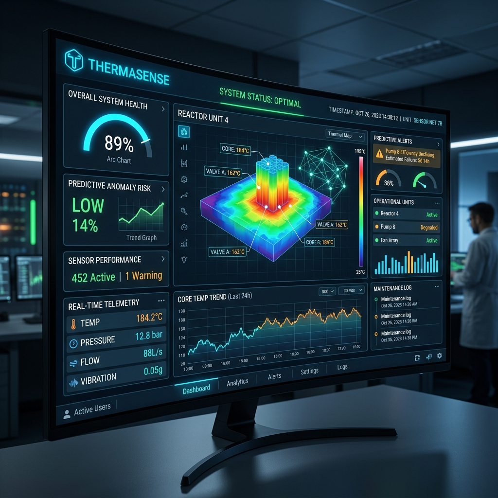

# ThermaSense - AI Server Cooling Optimisation System For Sustainable Data Centres.

ThermaSense is an ultra-modern, proactive data center cooling prediction system. It leverages a TensorFlow model via a FastAPI backend to predict potential future states based on 10 time-step historical telemetry data. The React-based frontend visualizes these metrics and system statuses dynamically using an intuitive, high-density command center layout.

## Features
- **Real-time Prediction**: Deep learning models assess whether system state is Normal, Warning, or Critical based on recent metrics.
- **Modern Dashboard**: Built with React and Vite, featuring a sleek, high-visibility dark UI for professional data center monitoring.
- **RESTful API**: FastAPI backend providing fast and well-documented endpoints for predictions and system inspection.

## Screenshots



## Tech Stack
- **Backend:** Python, FastAPI, TensorFlow/Keras, Uvicorn
- **Frontend:** React, Vite, Node.js

## Quickstart

### 1. Backend (FastAPI)
Navigate to the `backend` directory, install dependencies, and start the development server:
```bash
cd backend
python -m venv venv
.\venv\Scripts\activate
pip install -r requirements.txt
uvicorn main:app --reload --host 127.0.0.1 --port 8000
```
The API is typically accessible at `http://localhost:8000`.

### 2. Frontend (React + Vite)
Navigate to the `frontend` directory, install node modules, and start the development server:
```bash
cd frontend
npm install
npm run dev
```
The UI should become accessible in your browser via the provided local URL (typically `http://localhost:5173`).
